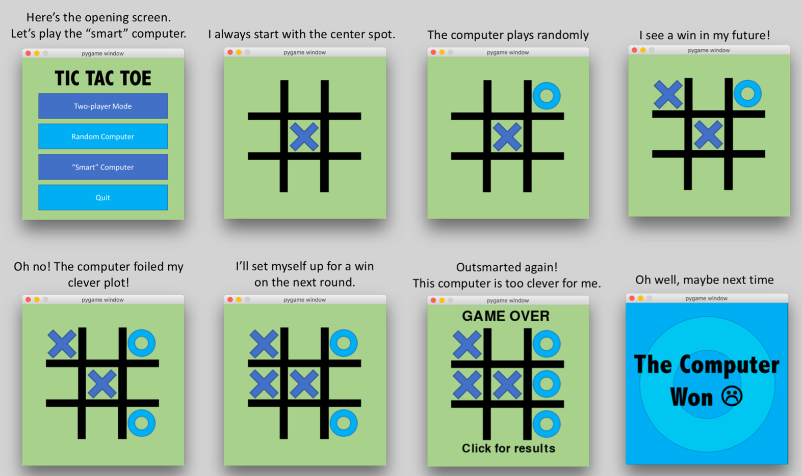

# TicTacToe

I've been distracted for the past while with this website, and some stats, and of course work stuff (most seniors finished school yesterday!), so it felt good to be working on a Python project after a too-long break.

This program has three options: two people can play, a person can play against an opponent that plays randomly, or a person can play against an opponent with a bit of intelligence.

I started out coding this using just the terminal window and displaying the board with the help of underscores, dashes, and whatever | is called (the "pipe"?)

But I had just written the beginnings of a "Space Invaders" program using the pygame module, and I wanted to try coding something with pygame from scratch.

I think it looks mighty fine, if I do say so myself. The images are all built in my favorite image editor: Power Point.

Most of the time, when I play against the smart computer, the game ends in a tie.

It feels a little odd to have created something as smart as I am, even if it is just a Tic-Tac-Toe game.

There are a few tricks up my sleve that I may want to teach the computer in the future.  However, the best next step is probably to keep statistics.
